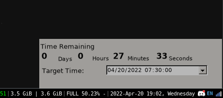

# TimeCounter
Widget style application for counting time for a certain event/time in future.
I have set time for my GRE exam, you can modify the source code to enter any time. I didn't feel the need to make GUI to change the date as I won't need it now. 

# Config for linux
I somehow made it work on linux using mono, but I can't figure out the windows hints for for i3 I managed by doing this:

    for_window [title="ZeroSofts - Time Counter"] floating enable border pixel 0 move position 1000 650

Which works for now.

